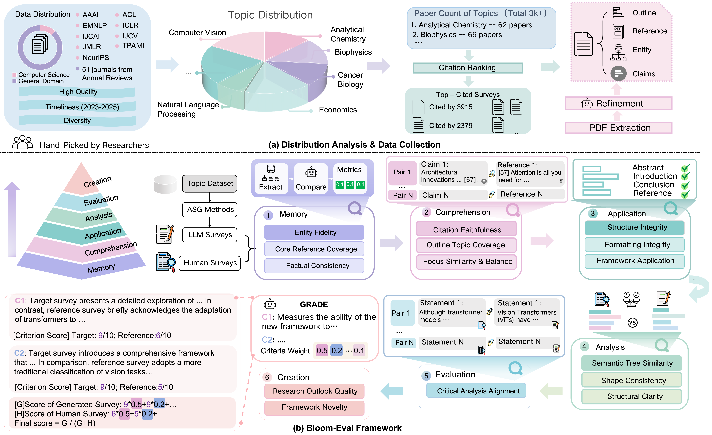

# Bloom-Eval: 基于布鲁姆分类学的自动综述生成分层评估基准

[](https://2026.aclweb.org/)
[](#)
[](https://opensource.org/licenses/MIT)

[English README](README.md)

这是论文 **"Bloom-Eval: A Hierarchical Evaluation Benchmark for Automatic Survey Generation Based on Bloom's Taxonomy"** 的官方仓库。本项目目前处于 Camera-ready 阶段，相关代码与数据正在整理并将逐步公开。

## 项目简介

Bloom-Eval 是首个面向自动综述生成（ASG）任务的六层级分层评估基准。该基准以布鲁姆教育目标分类学（Bloom's Taxonomy）为理论基础，旨在突破现有评估方法的扁平化问题，并从多个认知维度对 ASG 系统进行细粒度诊断。

## 框架概览


*图：Bloom-Eval 框架概览，展示了 (a) 数据收集流水线，以及 (b) 涵盖记忆、理解、应用、分析、评价、创造六个层级的评估体系。*

---

## 核心特性

### 1. 六层级认知评估体系
我们将 ASG 系统的认知能力划分为六个层级进行精细化分析：

- **记忆（Memory）**：评估对领域实体、核心文献及事实陈述的准确再现能力。
- **理解（Comprehension）**：评估对研究景观的总结能力、引用忠实度以及主题聚焦的准确性。
- **应用（Application）**：评估对学术格式规范、文档结构完整性及组织范式的执行能力。
- **分析（Analysis）**：评估层级逻辑的严密性、分析粒度的合适度以及结构的清晰度。
- **评价（Evaluation）**：评估对现有文献结论与局限性的批判性判断能力。
- **创造（Creation）**：评估构建新颖概念模型和提出未来研究方向的创新能力。

### 2. GRADE 评估方法
我们提出了 **GRADE**（Generative Rubric Adaptive Differential Evaluation）这一基于量表的对比评估方法：

- **透明量表**：评估器首先根据具体 topic 动态生成显式且带权重的评分标准。
- **差异化评分**：将系统生成综述与专家综述进行对比，并给出文本化理由，以提高评估过程的可审计性。

### 3. 大规模跨学科基准

- **规模**：包含 `3,506` 篇经人工核实的专家级综述论文。
- **覆盖范围**：来自 `60` 个高水平学术会议与期刊，包括 ACL、ICLR 以及 *Annual Reviews* 等。
- **多样性**：覆盖 `14` 个科学领域与 `20` 个代表性评测 topic。

---

## 当前公开内容

本仓库当前是一个面向论文 camera-ready 的初始公开版本，现阶段包含：

- benchmark 说明文档和指标定义
- 已公开的评测 topic 与相关元数据
- 用于 benchmark 构建与评测的清理版研究脚本
- 示例结果文件
- 论文源码与项目图表

后续版本还会继续补充更多 prompts、更完整的执行流程以及更丰富的元数据。

## 仓库结构

```text
.
├── code/               # 评测脚本与实验辅助工具
├── configs/            # 示例评测配置
├── data/               # benchmark 元数据、示例与 topic 文件
├── docs/               # benchmark、指标与复现文档
├── paper/              # 论文源码与图表
├── prompts/            # prompt 清单与发布说明
├── results/            # 示例 benchmark 输出与结果表
├── scripts/            # 发布检查工具
├── src/                # 最小 Python 包与 CLI
├── tests/              # 基础测试
└── README.md
```

## 数据与发布说明

该 benchmark 基于会议与期刊中的已发表论文构建。在未明确确认再发布权限的情况下，仓库更适合公开 metadata、标识符、派生标注和评测输出，而不直接公开受版权保护的全文 PDF。

## 引用

如果你使用了这个仓库，请引用 Bloom-Eval 论文。引用信息可见 `CITATION.cff`。
